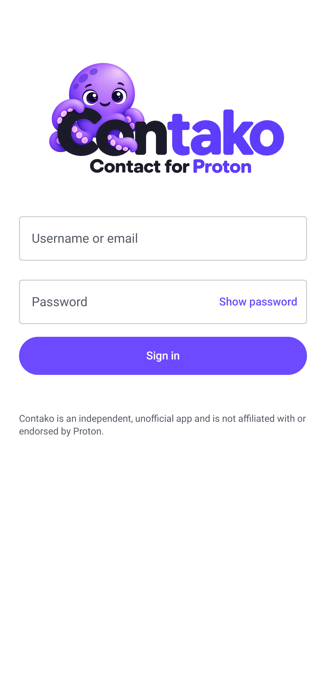
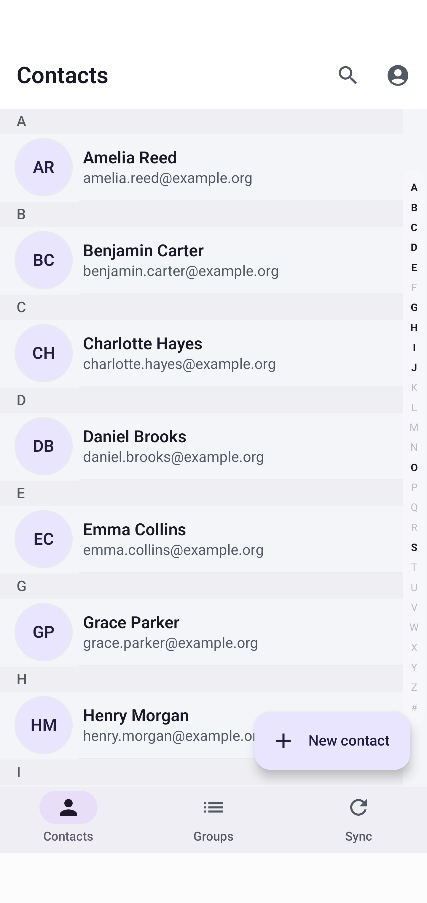
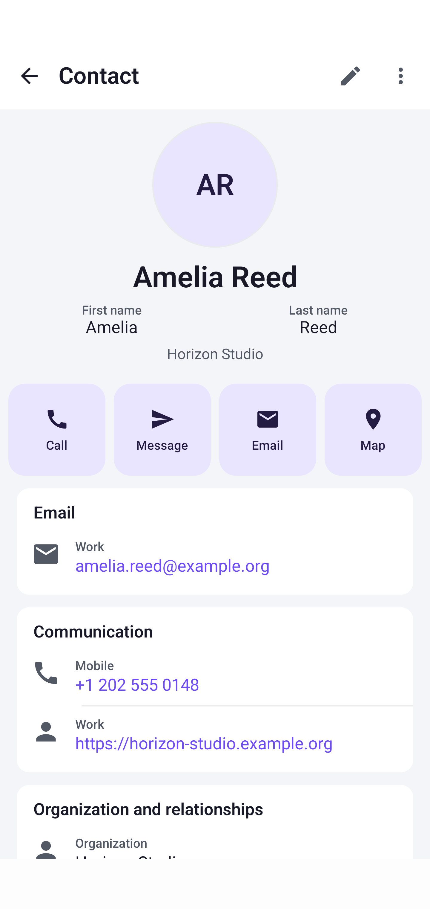

  

# Contako

Contako is an independent Android application that synchronizes Proton contacts
with Android's system contacts and lets you manage them from your phone.

Contako is developed by Patmanak with AI assistance for coding, documentation
and visual assets.

## A look inside

| Sign in | Your contacts | Contact details |
| :---: | :---: | :---: |
|  |  |  |

Screenshots show the application interface with fictional contacts.

## Features

- Browse and search your contacts offline, with alphabet navigation.
- Create, edit and delete contacts, including repeated fields and contact images.
- Manage Proton groups and assign them to individual email addresses.
- Use compatible system contact applications to edit the Contako contact account.
- Synchronize local changes automatically, inspect pending work and request repair.
- Sign in with a Proton account, including TOTP 2FA and CAPTCHA.
- Choose light, dark or system appearance and one of eight interface languages.
- Inspect separate Proton-upload and Android-copy queues and export a local,
  sanitized diagnostic summary from Sync.

Android 12 or later is required. One Proton account is supported at a time.
The current source version is **0.10.1**; see the
[changelog](CHANGELOG.md) and [known limitations](docs/KNOWN_LIMITATIONS.md).
Published APKs are available from [GitHub releases](https://github.com/patmanak/contako/releases).
The previous signed universal APK is available from the
[0.10.0-RC1 prerelease](https://github.com/patmanak/contako/releases/tag/0.10.0-RC1).
Release candidates are testing builds; review the known limitations before use.

## Using Contako

Start with the [user guide and FAQ](docs/USER_GUIDE.md): first synchronization,
editing in Android, email-specific groups, pending work and safe troubleshooting.
The [target specification](docs/SPECIFICATION.md) defines product scope and contracts.
The [changelog](CHANGELOG.md) summarizes features added or improved by version.

Important limits: Android exposes only the fields its contact provider supports;
Proton groups are assigned per email; automatic sync timing depends on Android.
An unresolved Samsung name-baseline case and yearless-date loss during Proton Web
edits remain documented in [Known limitations](docs/KNOWN_LIMITATIONS.md).
Physical qualification is scoped by device and scenario; see [QA](docs/QA.md).

## Build and test

Use the checked-in Gradle wrapper and Android SDK. Start with the
[build guide](app/README.md), then the
[QA guide](docs/QA.md): unit tests, software integration and physical phone/Proton
tests have separate plans and shared synthetic regression datasets.

For project work, read the [development guide](docs/DEVELOPMENT.md).
[Product scope](docs/PRODUCT.md), [architecture](docs/ARCHITECTURE.md),
[synchronization](docs/SYNCHRONIZATION.md) and
[field mapping](docs/CONTACTS.md) describe the current contracts.

## Contributing and reporting problems

See [Contributing](CONTRIBUTING.md) for bug reports, improvements and pull requests.
Report suspected vulnerabilities privately using [the security policy](SECURITY.md).

## Support my work

If you enjoy Contako, you can support my open-source projects and help fund
development tools and testing equipment. Thank you!

## Privacy and licensing

Contako has no analytics, advertising SDK or remote crash reporting. Contact
data is stored in the Android application sandbox and projected into Android
contacts. App-private contacts are deliberately not encrypted separately at
database level. Credentials use the protected Proton/Android storage lifecycle.
Android backup and device transfer of application data are disabled.
See the [privacy policy](docs/PRIVACY_POLICY.md) for data use, recipients,
retention and deletion, and [security](docs/SECURITY.md) for technical safeguards.

Contako is licensed **GPL-3.0-or-later**. See [LICENSE](LICENSE),
[licensing and provenance](docs/LICENSING.md) and
[third-party notices](app/legal/THIRD_PARTY_NOTICES.md).

Contako is not affiliated with, endorsed by, or sponsored by Proton AG.
